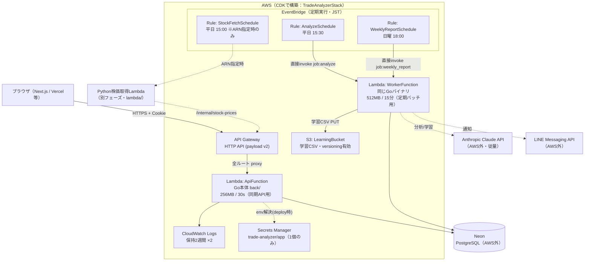
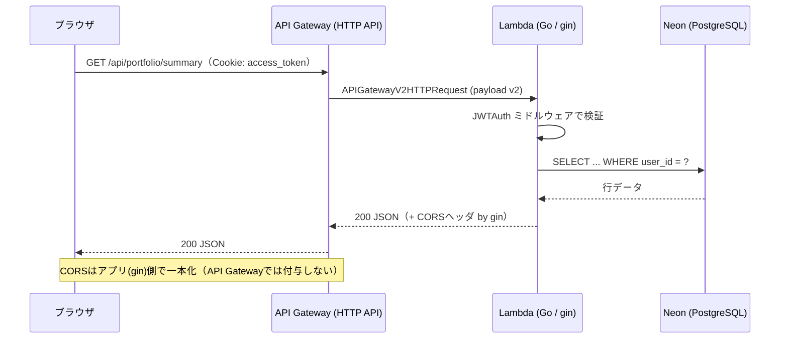
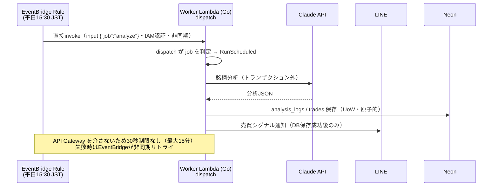
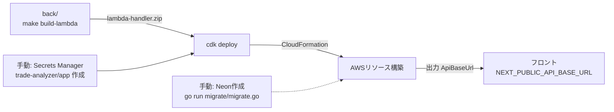
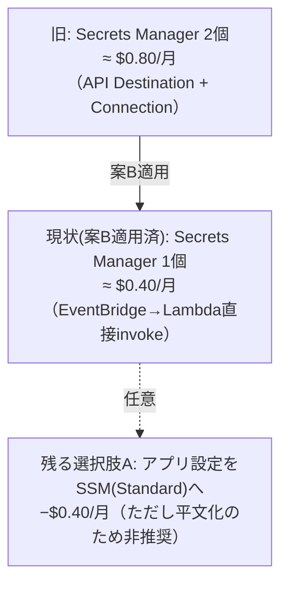

# インフラ構成・運用コスト解説（AWS CDK）

**対象**: ISSUE #7 で実装した AWS インフラ（`infra/` の CDK アプリ）
**作成日**: 2026-06-28
**前提**: 要件は `infra_requirements.md`、CDK実装は `infra/lib/trade-analyzer-stack.ts`。

本書は「どんな仕組みで動くか」と「AWS無料枠でいくらかかるか」を図解で説明する。

---

## 1. 全体アーキテクチャ

> **ポイント**
> - **同じGoバイナリ(bootstrap)を2つのLambdaにデプロイ**する。`main.go` の `dispatch` が
>   イベント種別を見て「API Gatewayリクエスト」と「定期バッチ(`job`)」を振り分ける。
>   - **ApiFunction**: ユーザー向け同期API。`gin` が `/api`・`/internal`・`/health` を捌く。短い30秒で隔離。
>   - **WorkerFunction**: EventBridge定期バッチ専用。Claude分析が長引いても**最大15分**まで実行可能。
> - 定期実行の分析/週次は **EventBridge → Worker Lambda の直接呼び出し**（API Gateway/API Destinationを介さない）。
>   認証は **IAM** で担保され `X-Internal-Secret` は不要。`{"job": "..."}` の定数inputで処理を指定する。
> - **Neon は AWS リソースではない**ためCDK管理外。接続URLはシークレット経由でLambdaに渡る。
> - この構成により EventBridge **Connection が不要**となり、付随する Secrets Manager シークレットが
>   発生しない（アプリ用シークレット1個のみ＝コスト削減。後述6章）。

---

## 2. 通常APIリクエストの流れ

---

## 3. 定期実行（分析シグナル）の流れ

> 分析パイプライン本体（`RunScheduled` / `RunWeekly` の中身）は**別フェーズ**。現状は配線確認用の
> スタブ（ログのみ・正常終了）で、EventBridge→Worker Lambda の経路は先行して稼働する。
> パイプライン実装時は `usecase/analysis_usecase.go` / `report_usecase.go` の該当メソッドを実装すればよい。

---

## 4. デプロイの流れ

詳細手順は `infra/README.md` を参照。

---

## 5. コンポーネント対応表

| 論理ID（CDK） | AWSリソース | 役割 | 主な設定 |
|---------------|-------------|------|----------|
| `ApiFunction` | Lambda | Go本体（同期API用） | `provided.al2023` / x86_64 / 256MB / **30s** / 環境変数にシークレット注入 |
| `WorkerFunction` | Lambda | Go本体（定期バッチ用・同一バイナリ） | `provided.al2023` / x86_64 / 512MB / **15分** / 同一環境変数 |
| `HttpApi` | API Gateway HTTP API | 全ルートを `ApiFunction` へプロキシ | payload v2 / CORSはアプリ側 |
| `LearningBucket` | S3 | 学習CSVのバージョン管理 | versioning / BLOCK_ALL / SSL強制 / **RETAIN** |
| `ApiFunctionLogs` / `WorkerFunctionLogs` | CloudWatch Logs | Lambdaログ | 保持**2週間** / DESTROY |
| `AnalyzeSchedule` | EventBridge Rule | 分析を `WorkerFunction` 直接invoke | cron 平日15:30 / input `{"job":"analyze"}` |
| `WeeklyReportSchedule` | EventBridge Rule | 週次を `WorkerFunction` 直接invoke | cron 日曜18:00 / input `{"job":"weekly_report"}` |
| `StockFetchSchedule` | EventBridge Rule | 株価取得の発火 | `-c stockFetchLambdaArn=...` 指定時のみ生成 |
| （手動作成） | Secrets Manager | アプリのシークレット（**1個のみ**） | `trade-analyzer/app`（JSON） |

---

## 6. 運用コスト試算（重要）

### 6.1 結論

> **ほぼ全リソースが無料枠内で動作する。唯一の継続課金は Secrets Manager の約 $0.40/月（約¥60）**
> （= アプリ用シークレット `trade-analyzer/app` 1個のみ）。
> Secrets Manager には**恒久的な無料枠が無い**（30日間の無料トライアルのみ）ため、ここだけは課金される。
>
> 旧構成（EventBridge API Destination）では Connection が自動生成するシークレットがもう1個発生し
> 約 $0.80/月だったが、**定期実行を Lambda 直接呼び出しに変更（案B）したことで Connection が不要となり
> $0.40/月に半減**した。

想定使用量: 個人〜少人数の利用（API数千〜十万リクエスト/月、定期実行は週数回）。

### 6.2 サービス別の内訳

| サービス | 無料枠 | 本アプリの想定 | 12ヶ月以内 | 12ヶ月以降 |
|----------|--------|----------------|-----------|-----------|
| **Lambda** | 100万req + 40万GB秒/月（**恒久**） | API数万req(256MB)＋バッチ月~26回(512MB) | **$0** | **$0** |
| **API Gateway (HTTP API)** | 100万req/月（最初の12ヶ月） | 数千〜十万req | **$0** | ~$0.10 |
| **S3** | 5GB・GET2万・PUT2千/月（12ヶ月） | 学習CSV 数KB×週次 | **$0** | <$0.05 |
| **EventBridge** | スケジュールルール・呼び出しは**無料** | ルール2〜3本・月~26回 | **$0** | **$0** |
| **CloudWatch Logs** | 取込5GB+保存5GB | 低volume・2週保持・ロググループ2本 | **$0** | **$0** |
| **KMS** | AWSマネージドキーは**無料** | secret暗号化 | **$0** | **$0** |
| **データ転送(OUT)** | 100GB/月（新無料枠） | 低volume | **$0** | **$0** |
| **Secrets Manager** | **無料枠なし**（30日試用のみ） | secret **1個** | **~$0.40** | **~$0.40** |
| **合計（AWS）** | | | **≈ $0.40/月** | **≈ $0.50〜0.60/月** |

> ⚠️ **AWS外の従量課金（無料枠対象外）**
> - **Claude API（Anthropic）**: トークン従量。分析の回数×銘柄数×モデルで変動。**ジョブ別にモデルを割り当てる**:
>   - 毎日分析（`RunScheduled`・高頻度）= **Sonnet 4.6**（`$3/$15`・コスト重視。`ANTHROPIC_MODEL`）
>   - 週次学習（`RunWeekly`・月4回・高レバレッジ）= **Opus 4.8**（`$5/$25`・推論重視。`ANTHROPIC_MODEL_WEEKLY`）
>   - 週次は低頻度のためOpus化してもコスト増はわずかで、生成した戦略CSVが翌週の全毎日分析に複利で効く。
> - **LINE Messaging API**: 無料プランは push 200通/月まで。
> - **Neon**: Free プランあり（0.5GB・自動サスペンド）。本構成では Neon 自体はAWS課金に含まれない。

> **モデル割り当ての実装**: `back/main.go` で `dailyClaudeClient`（`NewClaudeClient`）と
> `weeklyClaudeClient`（`NewClaudeClientForModel`・既定 `claude-opus-4-8`）を生成し、それぞれ
> `AnalysisUsecase` / `ReportUsecase` に注入する。モデルは `ANTHROPIC_MODEL` / `ANTHROPIC_MODEL_WEEKLY`
> 環境変数（CDK context `anthropicModel` / `anthropicModelWeekly`）で上書き可能。

### 6.3 適用済みの最適化（案B）と残る選択肢

- **案B（適用済み）**: 分析/週次を EventBridge → Worker Lambda の直接呼び出しに変更。これにより
  - Connection 由来のシークレット（$0.40/月）が**不要**になった。
  - API Gateway の **30秒制限を回避**（Worker Lambda は最大15分）。
  - 認証は IAM に一本化され、定期実行に `X-Internal-Secret` が不要になった。
- **残る選択肢A（アプリ設定をSSMへ・任意）**: SSM Parameter Store の Standard 文字列は無料だが
  - 値が**平文**保存になり暗号化が弱まる。
  - SecureString の動的参照（`{{resolve:ssm-secure}}`）は **Lambda 環境変数では非対応**。
  - → セキュリティとのトレードオフのため、本構成では暗号化を優先し **Secrets Manager を維持**している。

---

## 7. セキュリティ・設計上の注意点

| 項目 | 内容 | 対応/方針 |
|------|------|-----------|
| **定期バッチの実行時間** | Worker Lambda は最大15分。API Gatewayを介さないため30秒制限は受けない（案B適用済み） | 分析が15分を超える規模になったら Step Functions 等での分割を検討 |
| **同一バイナリ2関数** | ApiFunction と WorkerFunction は同じ `bootstrap` を使い、`dispatch` がイベントで振り分ける | デプロイは `make build-lambda` の1つのzipを両関数が参照。タイムアウト/メモリのみ差異 |
| **シークレットのLambda環境変数** | CloudFormation の dynamic reference でデプロイ時に解決され、値はLambda設定（コンソールのenv）に展開される | ローテーション時は再デプロイが必要。env露出を避けたい場合は実行時に SDK で Secrets Manager 取得する設計に変更（要コード改修） |
| **Cookie / CORS** | 本番は `APP_ENV=production` で `Secure` 付与。CORSは **アプリ(gin)側に一本化**（API Gateway側では付与しない） | フロントとAPIが別ドメインの場合の `SameSite` 方針は `infra_requirements.md` 2章を参照 |
| **S3 削除保護** | `RemovalPolicy.RETAIN`。`cdk destroy` でも学習バケットは残る | 不要時は手動で空にして削除 |
| **内部API認証** | HTTPの `/internal/*` は `X-Internal-Secret` で保護（Python株価取得Lambda用）。定期分析/週次は**HTTPを通らず**EventBridge→Lambda直接invokeのためIAM認証 | `INTERNAL_API_SECRET` はアプリ用シークレットと同一値を使用 |

---

## 8. 関連ファイル

- CDK実装: `infra/lib/trade-analyzer-stack.ts`
- エントリ: `infra/bin/infra.ts`
- デプロイ手順: `infra/README.md`
- インフラ要件: `doc/dev-spec/infra_requirements.md`
- 外部連携実装: `back/external/`（Claude / LINE / S3）
